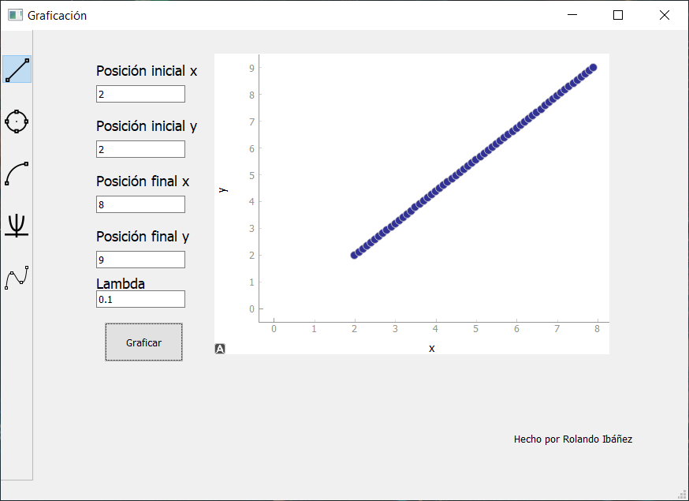
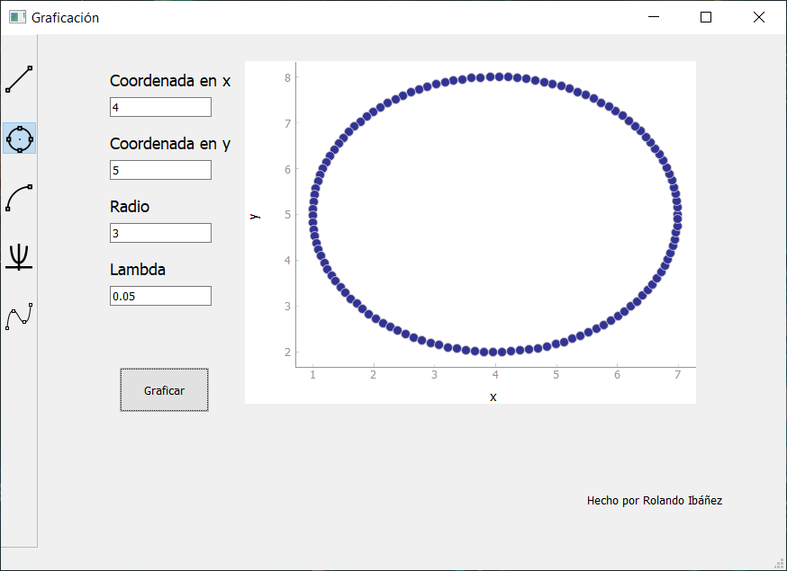
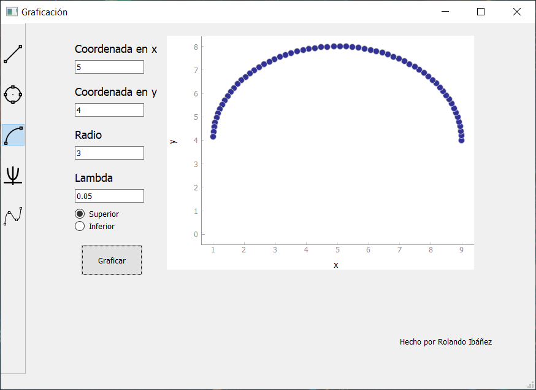
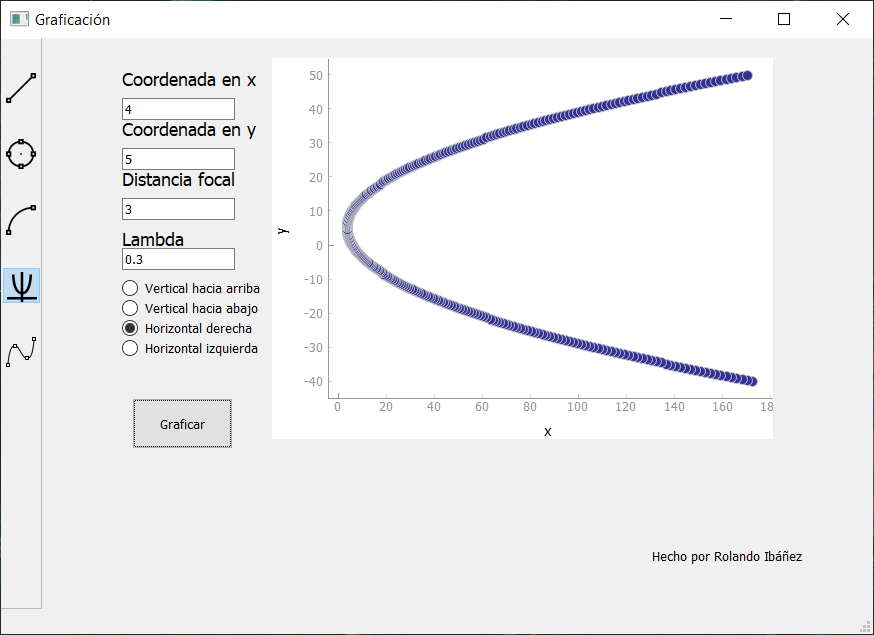
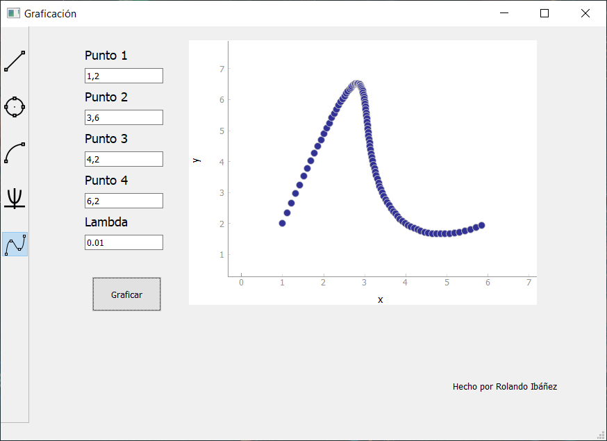

# Plotting software

This is a GUI that helps to understand how different plotting software works by letting you select a pattern figure, then chosing different points so the figure can be draw.
The most important part is that every figure is plot by different function which parameter to change is **lambda**, by changing its parameter near to 1 there will be fewer points in the figure, otherwise it will have more points if it's value approximate to 0.  
The GUI is written in *Python* using *PyQt5*. Here are some images that show how the GUI works:

 
 
 
 
 
 
